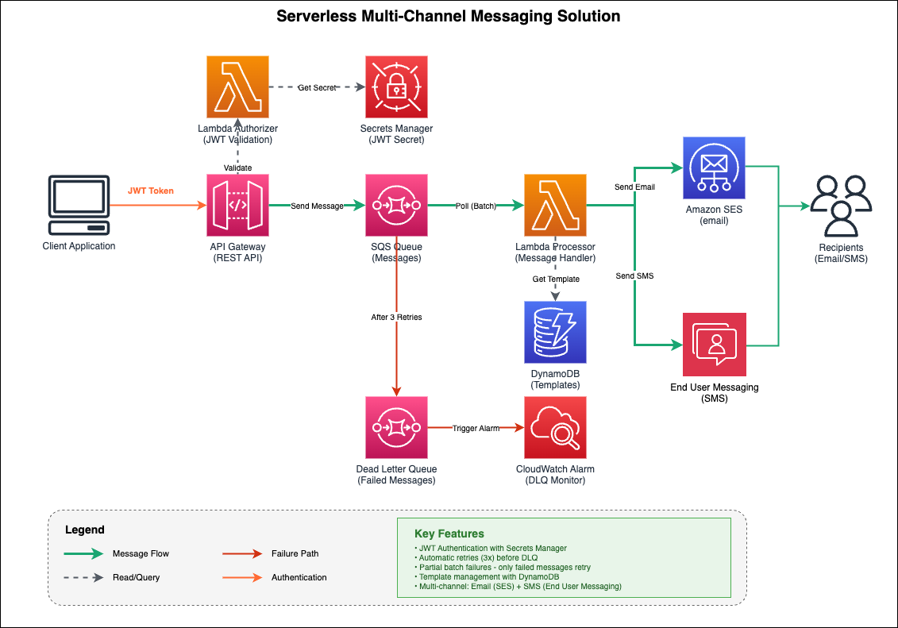

# Serverless Multi-Channel Messaging API with Template Management

A serverless multi-channel messaging API that sends email (via Amazon SES) and SMS (via AWS End User Messaging) through a single REST endpoint. Messages are queued via SQS for reliable async processing, with DynamoDB-backed templates for reusable, variable-driven content.

## Architecture



## Key Features

- **JWT Authentication**: Secure API access with JSON Web Tokens
- **Automatic Retries**: Messages retry 3 times before moving to DLQ
- **Visibility Timeout**: 5 minutes (prevents duplicate processing)
- **Dead Letter Queue**: Preserves failed messages for 14 days
- **Partial Batch Failures**: Only failed messages retry
- **CloudWatch Alarm**: Monitors DLQ (requires SNS configuration to receive notifications)
- **Template Management**: Store SMS/email templates in DynamoDB
- **AWS Secrets Manager**: JWT secret stored securely in AWS Secrets Manager

## Getting Started

### Prerequisites

- AWS CLI and SAM CLI installed
- Python 3.12+
- Verified email addresses in Amazon SES
- SMS origination number in AWS End User Messaging SMS

### Quick Deploy

```bash
# 1. Generate a strong JWT secret
python -c "import secrets; print(secrets.token_urlsafe(32))"

# 2. Build and deploy
sam build
sam deploy --guided
```

For detailed deployment steps, SES/SMS configuration, template setup, monitoring, and production readiness, see [DEPLOYMENT.md](DEPLOYMENT.md).

## Authentication

This API uses JWT (JSON Web Token) authentication. All API requests must include a valid JWT token.

### JWT Token Requirements

Tokens must include:
- `iss` (issuer): `messaging-api`
- `sub` (subject): User identifier
- `exp` (expiration): Token expiration time
- `iat` (issued at): Token creation time

Optional claims:
- `email`: User email
- `customer_id`: Customer identifier (forwarded as `customerId` in the API Gateway authorizer context for downstream services to use for tenant isolation, scoped logging, etc.)

### Generate JWT Tokens

Use the provided `generate_jwt.py` script:

```bash
# Set your JWT secret (must match the one used during deployment)
export JWT_SECRET="your-secret-here"

# Generate a token
python generate_jwt.py <user_id> [email] [customer_id]
```

Example:
```bash
export JWT_SECRET="your-secret-here"
python generate_jwt.py user123 user@example.com cust456
```

### Rotate JWT Secret

To rotate the JWT secret:

```bash
aws secretsmanager update-secret \
  --secret-id <your-stack-name>-jwt-secret \
  --secret-string "new-secret-key-here" \
  --region <your-region>
```

The Lambda authorizer automatically picks up the new secret.

## Usage Examples

**Note:** All requests require a JWT token in the Authorization header.

### Email Only

```bash
curl -X POST "https://your-api-endpoint/dev/" \
  -H 'Content-Type: application/json' \
  -H 'Authorization: Bearer YOUR_JWT_TOKEN' \
  -d '{
    "TraceId": "12345",
    "EmailMessage": {
      "FromAddress": "alerts@example.com",
      "Subject": "Low Balance Alert",
      "Substitutions": {
        "productName": "CHEQUING",
        "membershipNumber": "****5493",
        "accountBalance": "100.00"
      }
    },
    "Addresses": {
      "user@example.com": {
        "ChannelType": "EMAIL"
      }
    }
  }'
```

### SMS with Template

```bash
curl -X POST "https://your-api-endpoint/dev/" \
  -H 'Content-Type: application/json' \
  -H 'Authorization: Bearer YOUR_JWT_TOKEN' \
  -d '{
    "TraceId": "12346",
    "SMSMessage": {
      "MessageType": "TRANSACTIONAL",
      "OriginationNumber": "your-pool-id",
      "TemplateName": "alert-template"
    },
    "Addresses": {
      "+16048621234": {
        "ChannelType": "SMS",
        "Substitutions": {
          "productName": "SAVINGS",
          "membershipNumber": "****7303",
          "accountBalance": "50.00"
        }
      }
    }
  }'
```

### SMS with Inline Message

```bash
curl -X POST "https://your-api-endpoint/dev/" \
  -H 'Content-Type: application/json' \
  -H 'Authorization: Bearer YOUR_JWT_TOKEN' \
  -d '{
    "TraceId": "12347",
    "SMSMessage": {
      "MessageType": "TRANSACTIONAL",
      "OriginationNumber": "your-pool-id",
      "MessageBody": "Your payment of $50 is due tomorrow"
    },
    "Addresses": {
      "+16048621234": {
        "ChannelType": "SMS"
      }
    }
  }'
```

### Both Email and SMS

```bash
curl -X POST "https://your-api-endpoint/dev/" \
  -H 'Content-Type: application/json' \
  -H 'Authorization: Bearer YOUR_JWT_TOKEN' \
  -d '{
    "TraceId": "12348",
    "EmailMessage": {
      "FromAddress": "alerts@example.com",
      "Subject": "Account Alert",
      "ConfigurationSetName": "email-analytics",
      "Substitutions": {
        "productName": "CHEQUING",
        "membershipNumber": "****5493",
        "accountBalance": "100.00"
      }
    },
    "SMSMessage": {
      "MessageType": "TRANSACTIONAL",
      "OriginationNumber": "your-pool-id",
      "TemplateName": "alert-template",
      "ConfigurationSetName": "sms-analytics"
    },
    "Addresses": {
      "user@example.com": {
        "ChannelType": "EMAIL"
      },
      "+16048621234": {
        "ChannelType": "SMS",
        "Substitutions": {
          "productName": "CHEQUING",
          "membershipNumber": "****7303",
          "accountBalance": "100.00"
        }
      }
    }
  }'
```

## Configuration

### Configuration Sets (Optional)

Configuration sets enable tracking and analytics for email and SMS messages.

**Email Configuration Sets (SES):**
- Track email delivery, opens, clicks, bounces, and complaints
- Send events to CloudWatch, Kinesis, or SNS
- Monitor email reputation and engagement

**SMS Configuration Sets (AWS End User Messaging):**
- Track SMS delivery and failure events
- Monitor SMS sending patterns
- Analyze message costs by destination

**Two ways to use configuration sets:**

1. **Deployment-level defaults** - Set once, applies to all messages:
   ```bash
   sam deploy --parameter-overrides \
     SESConfigurationSet=my-email-config-set \
     SMSConfigurationSet=my-sms-config-set
   ```

2. **Per-message override** - Specify in API request:
   ```json
   {
     "EmailMessage": {
       "FromAddress": "alerts@example.com",
       "ConfigurationSetName": "high-priority-emails"
     },
     "SMSMessage": {
       "OriginationNumber": "your-pool-id",
       "ConfigurationSetName": "transactional-sms"
     }
   }
   ```

Per-message configuration sets override deployment defaults, allowing you to:
- Use different tracking for different message types
- Separate analytics by campaign or priority
- Route events to different destinations based on message context

### Adjust Retry Count

Change `maxReceiveCount` in template.yaml (default: 3)

### Adjust Visibility Timeout

Change `VisibilityTimeout` based on Lambda duration (default: 300s)

### Batch Size

Change `BatchSize` for Lambda (default: 10)

### Message Retention

- Main Queue: 4 days (default)
- DLQ: 14 days (default)

## Cost Estimate (1M Requests)

| Service | Cost |
|---------|------|
| API Gateway | $3.50 |
| SQS | $0.40 |
| Lambda | $2.50 |
| SES | $100.00 |
| SMS | $10,000.00 |
| **Total** | **$10,106.40** |

## Payload Format

The solution uses a simple, flat JSON structure:

```json
{
  "TraceId": "unique-id",
  "EmailMessage": {
    "FromAddress": "sender@example.com",
    "Subject": "Subject line",
    "Substitutions": {
      "variable": "value"
    }
  },
  "SMSMessage": {
    "MessageType": "TRANSACTIONAL",
    "OriginationNumber": "262782",
    "TemplateName": "template-name"
  },
  "Addresses": {
    "recipient@example.com": {
      "ChannelType": "EMAIL"
    },
    "+1234567890": {
      "ChannelType": "SMS",
      "Substitutions": {
        "variable": "value"
      }
    }
  }
}
```

## Substitution Variables

You can use either format:

**String format (simpler):**
```json
{
  "Substitutions": {
    "productName": "CHEQUING",
    "accountBalance": "100.00"
  }
}
```

**Array format (backward compatible):**
```json
{
  "Substitutions": {
    "productName": ["CHEQUING"],
    "accountBalance": ["100.00"]
  }
}
```

Both work! The Lambda handles both formats automatically.

## Contribution 

See [CONTRIBUTING](CONTRIBUTING.md) for more information.

## Security

See [CONTRIBUTING](CONTRIBUTING.md#security-issue-notifications) for more information.

## License

This library is licensed under the MIT-0 License. See the LICENSE file.
